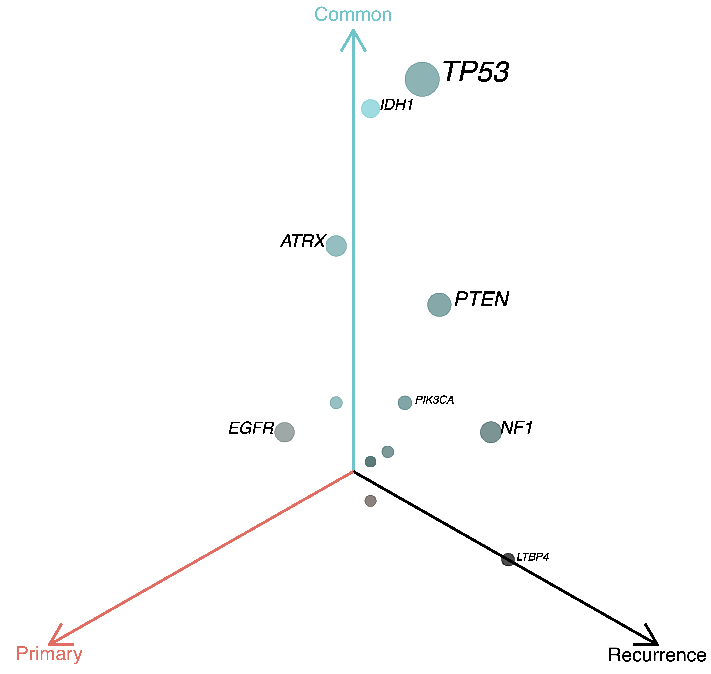
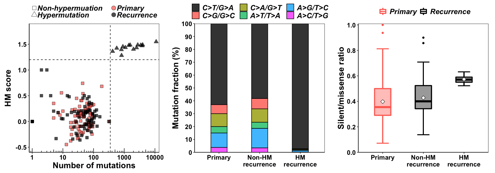
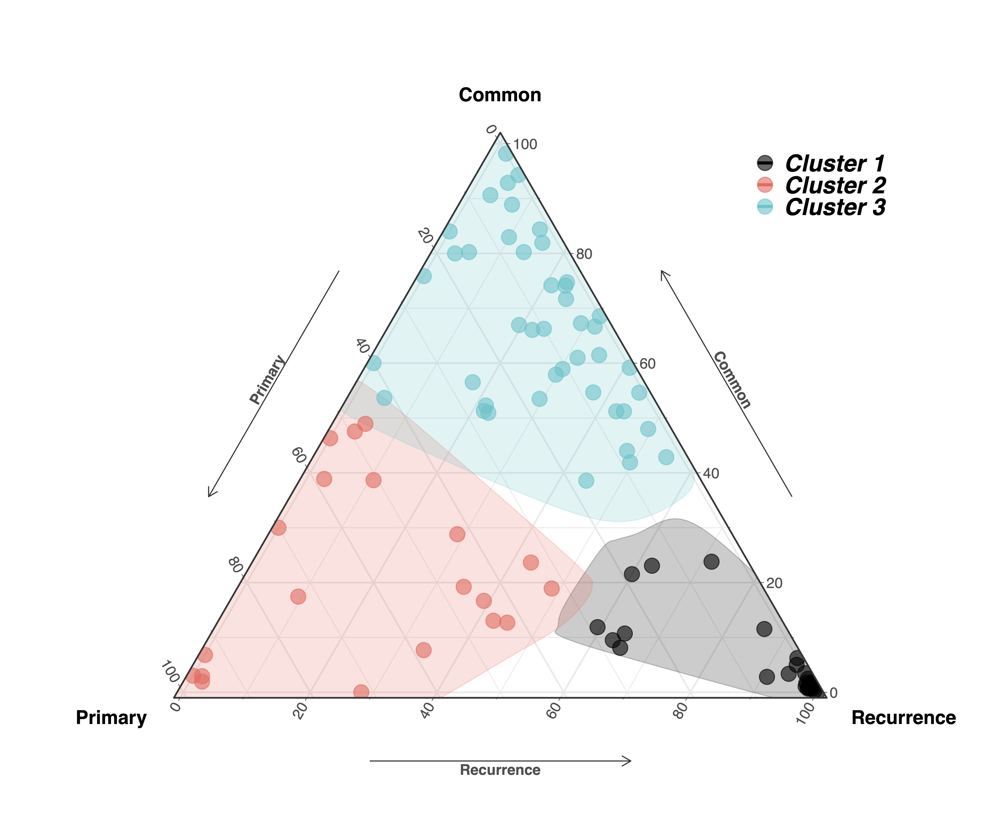
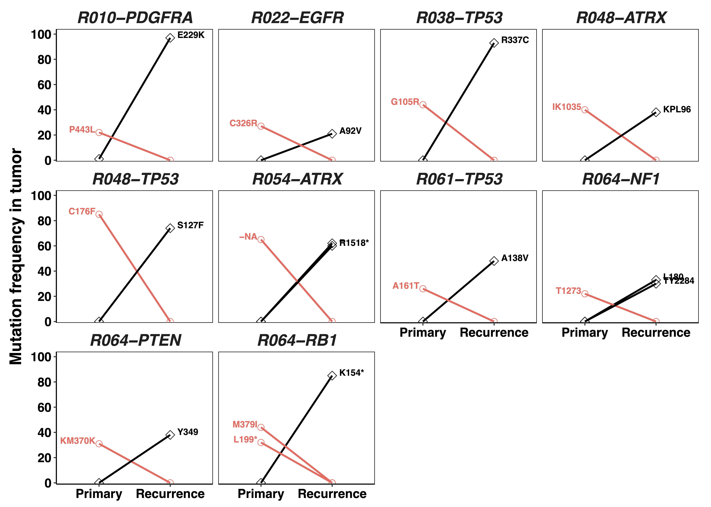

CELLO: Cancer EvoLutionary analysis using LOngitudinal genomic data
================
SONG, Dong
1/15/2020


## Loading required R packages

``` r
library(ggplot2)
library(gridExtra)
library(grid)
library(reshape2)
library(ggtern)
library(ggalt)
library("igraph")
```

## Loading CELLO functions

……

## CELLO Pipeline

``` r
savi.table<-somaticfilter("./input.savi.report.txt",25,4)
head(savi.table[,1:12])
```

    ##   chr       pos ref alt      id_snp snp_allele_freq snp_common   id_cosmic   cosmic_n_samples_mut cosmic_n_samples_gene                               Effect Effect_Impact
    ## 1  10   5248362   T   C           -               -          -           -                      -                     -  splice_donor_variant+intron_variant          HIGH
    ## 2  10  27703023   A   T           -               -          -           -                      -                     -                     missense_variant      MODERATE
    ## 3  10 122263428   G   A rs747041396               -          -           -                      -                     -                     missense_variant      MODERATE
    ## 4  11    209598   C   T           -               -          -           -                      -                     -                   synonymous_variant           LOW
    ## 5  11  20676292  TG   T           -               -          -           -                      -                     -                   frameshift_variant          HIGH
    ## 6  12  21422680   C   T rs772790612               -          - COSM3871273                      2                     -                   synonymous_variant           LOW

``` r
knownDriverGene <- c('LTBP4','PTPN11','NF1','RB1','PDGFRA','PIK3CG','PIK3R1','PIK3CA','PTEN','EGFR','IDH1','ATRX','TP53')

mutNum.table <- mutStatistics(savi.table,5)

head(mutNum.table)
```

    ##   Patients Primary Common Recurrent
    ## 1     R001       4     58         2
    ## 2     R002      23     46        19
    ## 3     R003      49      1         1
    ## 4     R004       2     48         4
    ## 5     R005      24     52        16
    ## 6     R006       5      6       167

``` r
mutGenes.table <- mutGenes(savi.table, knownDriverGene,5,remove_LOW = TRUE)
head(mutGenes.table)
```

    ##      LTBP4 PTPN11 NF1 RB1 PDGFRA PIK3CG PIK3R1 PIK3CA PTEN EGFR IDH1 ATRX TP53
    ## R001 "N"   "N"    "N" "N" "N"    "N"    "N"    "C"    "N"  "N"  "N"  "N"  "C" 
    ## R002 "N"   "N"    "C" "N" "N"    "C"    "C"    "N"    "N"  "N"  "N"  "N"  "N" 
    ## R003 "N"   "N"    "N" "N" "N"    "N"    "N"    "N"    "N"  "N"  "N"  "N"  "N" 
    ## R004 "N"   "N"    "C" "N" "N"    "N"    "N"    "C"    "N"  "N"  "N"  "N"  "N" 
    ## R005 "N"   "N"    "N" "N" "N"    "N"    "N"    "C"    "N"  "P"  "N"  "N"  "N" 
    ## R006 "R"   "N"    "R" "N" "N"    "N"    "N"    "R"    "N"  "N"  "N"  "N"  "R"

``` r
mutLandscape(mutNum.table,mutGenes.table)
```


``` r
coMutation(mutGenes.table)
```

    ## Warning: Removed 13 rows containing missing values (geom_point).

<div align=center></div>

``` r
freq.table <- freqMutation(savi.table, knownDriverGene,mutGenes.table,5)
```



``` r
HM.table <- hyperMutation(savi.table,15,350,1.2)
```



    ## P-value between Primary and NonHM Recurrence:       0.161138148010592
    ## P-value between Primary and HM Recurrence:          9.87242860746631e-06
    ## P-value between NonHM Recurrence and HM Recurrence: 6.50689011385997e-05

``` r
Cluster.table <- evoCluster(mutNum.table)
```

    ## Warning: Solution to limits produces range outside of [0,1] for some scales



``` r
switch.table <- mutSwitch(savi.table,knownDriverGene,5,20)
```




``` r
selGene <-c('LTBP4','IDH1','ATRX','TP53','NF1','MSH6','PIK3CG','PIK3R1','PIK3CA','PTEN','EGFR')
allMutGenes.table <- mutGenes(savi.table, selGene,5,remove_LOW = TRUE)
TEDGedge.table <- getTEDG(allMutGenes.table)
```


``` r
TEDGedge.table
```

    ##    geneA    geneB    weight label                               
    ## 1  "IDH1"   "LTBP4"  "3"    "R027;R049;R055"                    
    ## 2  "ATRX"   "LTBP4"  "1"    "R049"                              
    ## 3  "TP53"   "LTBP4"  "3"    "R027;R049;R055"                    
    ## 4  "PTEN"   "LTBP4"  "2"    "R007;R039"                         
    ## 5  "EGFR"   "LTBP4"  "2"    "R022;R039"                         
    ## 6  "IDH1"   "TP53"   "1"    "R054"                              
    ## 7  "IDH1"   "NF1"    "5"    "R043;R049;R051;R053;R055"          
    ## 8  "IDH1"   "MSH6"   "3"    "R027;R044;R051"                    
    ## 9  "IDH1"   "PIK3R1" "1"    "R051"                              
    ## 10 "IDH1"   "PIK3CA" "2"    "R048;R049"                         
    ## 11 "IDH1"   "PTEN"   "2"    "R046;R051"                         
    ## 12 "IDH1"   "EGFR"   "1"    "R027"                              
    ## 13 "ATRX"   "TP53"   "1"    "R054"                              
    ## 14 "ATRX"   "NF1"    "5"    "R043;R049;R051;R053;R077"          
    ## 15 "ATRX"   "MSH6"   "2"    "R044;R051"                         
    ## 16 "ATRX"   "PIK3R1" "1"    "R051"                              
    ## 17 "ATRX"   "PIK3CA" "2"    "R048;R049"                         
    ## 18 "EGFR"   "ATRX"   "1"    "R039"                              
    ## 19 "TP53"   "NF1"    "7"    "R034;R043;R049;R051;R053;R055;R077"
    ## 20 "TP53"   "MSH6"   "3"    "R027;R044;R051"                    
    ## 21 "TP53"   "PIK3CG" "1"    "R042"                              
    ## 22 "TP53"   "PIK3CA" "2"    "R048;R049"                         
    ## 23 "TP53"   "PTEN"   "5"    "R034;R038;R046;R051;R061"          
    ## 24 "EGFR"   "TP53"   "2"    "R022;R039"                         
    ## 25 "NF1"    "PIK3CG" "1"    "R042"                              
    ## 26 "PIK3R1" "NF1"    "1"    "R100"                              
    ## 27 "PTEN"   "MSH6"   "2"    "R007;R039"                         
    ## 28 "EGFR"   "MSH6"   "2"    "R022;R039"                         
    ## 29 "PTEN"   "PIK3CG" "1"    "R042"                              
    ## 30 "PIK3R1" "PTEN"   "1"    "R024"

## Contact

For any technical questions about this R code, please contact Dong Song via email: dsongad AT connect.ust.hk

