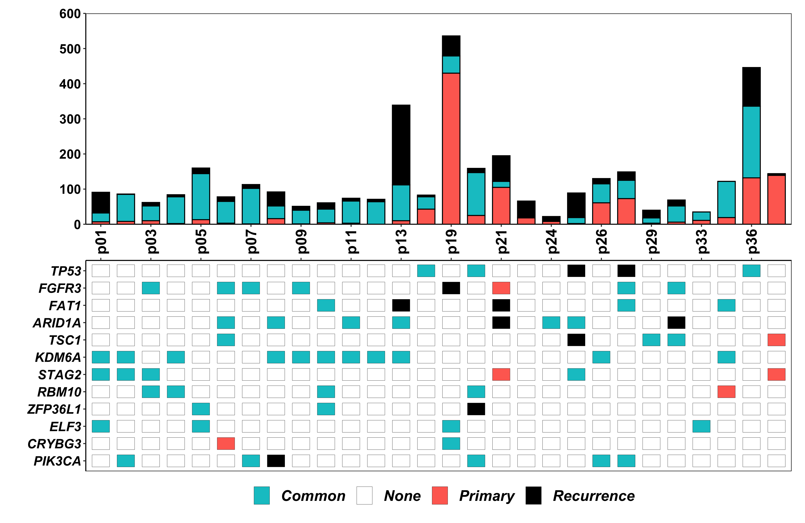
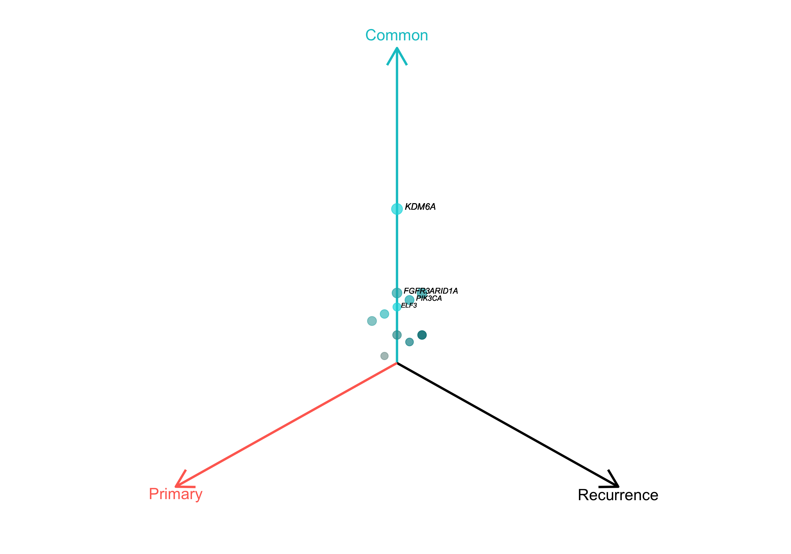
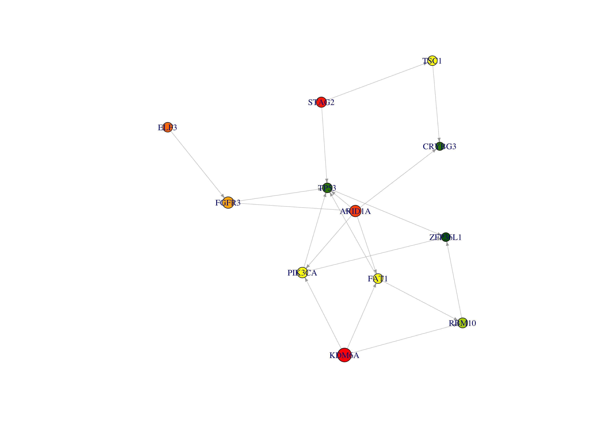

CELLO: Cancer EvoLutionary analysis using LOngitudinal genomic data
================
SONG, Dong
5/26/2020

## Ownership

Wang Lab at HKUST (<http://wang-lab.ust.hk/>)

## Introduction

Cancer EvoLutionary analysis using LOngitudinal genomic data (CELLO) is
a protocal for comprehensive analysis of longitudinal genomic sequencing
data in cancer. It was originally developed by Jiguang Wang \[1,2\], and
was then packed up by Biaobin Jiang and Dong Song in MATLAB and R
seperately. This code was written in R.

## Datasets

The input SAVI report (bladder.input.savi.txt) consists of a list of
genetic variants from 28 bladder
    patients.

## Loading CELLO package

``` r
source('CELLO.R')
```

## CELLO Pipeline

``` r
savi.table <- mutRead("../../bladder.input.savi.txt",20,1,5)
```

``` r
head(savi.table[,1:10])
```

    ##    chr       pos ref alt                                           Effect
    ## 1 chr1  78329668   G   C                                 missense_variant
    ## 2 chr1  93201960   C   G                                 missense_variant
    ## 3 chr1 120471599   C   T           missense_variant+splice_region_variant
    ## 4 chr1 145440746   G   C missense_variant, intron_variant, intron_variant
    ## 5 chr1 185962382   T   C                                 missense_variant
    ## 6 chr1 186645143   G   C                                 missense_variant
    ##                  Effect_Impact Functional_Class  Codon_Change Amino_Acid_Change
    ## 1                     MODERATE         MISSENSE       caG/caC             Q488H
    ## 2                     MODERATE         MISSENSE       caG/caC              Q92H
    ## 3                     MODERATE         MISSENSE       Ggc/Agc            G1298S
    ## 4 MODERATE, MODIFIER, MODIFIER   MISSENSE, -, - Gag/Cag, -, -       E316Q, -, -
    ## 5                     MODERATE         MISSENSE       cTt/cCt            L1149P
    ## 6                     MODERATE         MISSENSE       Caa/Gaa             Q382E
    ##   Amino_Acid_length
    ## 1               633
    ## 2               810
    ## 3              2471
    ## 4   391, 4963, 3626
    ## 5              5635
    ## 6               604

``` r
knownDriverGene <- c('PIK3CA','CRYBG3','ELF3','ZFP36L1','RBM10','STAG2','KDM6A','TSC1','ARID1A','FAT1','FGFR3','TP53')
stats <- mutStats(savi.table, knownDriverGene,5,remove_LOW = TRUE)
```

``` r
head(stats$mutNum.table)
```

    ##   Patients Primary Common Recurrent
    ## 1      p01       7     25        59
    ## 2      p02       8     77         1
    ## 3      p03      10     42        10
    ## 4      p04       2     76         6
    ## 5      p05      13    131        16
    ## 6      p06       3     62        13

``` r
head(stats$mutGenes.table)
```

    ##     PIK3CA CRYBG3 ELF3 ZFP36L1 RBM10 STAG2 KDM6A TSC1 ARID1A FAT1 FGFR3 TP53
    ## p01 "N"    "N"    "C"  "N"     "N"   "C"   "C"   "N"  "N"    "N"  "N"   "N" 
    ## p02 "C"    "N"    "N"  "N"     "N"   "C"   "C"   "N"  "N"    "N"  "N"   "N" 
    ## p03 "N"    "N"    "N"  "N"     "C"   "C"   "N"   "N"  "N"    "N"  "C"   "N" 
    ## p04 "N"    "N"    "N"  "N"     "C"   "N"   "C"   "N"  "N"    "N"  "N"   "N" 
    ## p05 "N"    "N"    "C"  "C"     "N"   "N"   "N"   "N"  "N"    "N"  "N"   "N" 
    ## p06 "N"    "P"    "N"  "N"     "N"   "N"   "N"   "C"  "C"    "N"  "C"   "N"

``` r
mutLandscape(stats$mutNum.table,stats$mutGenes.table)
```



``` r
mutCorrelation(stats$mutGenes.table)
```


``` r
freq.table <- mutFrequency(savi.table, knownDriverGene,stats$mutGenes.table,5)
```



``` r
head(freq.table)
```

    ##         Primary Recurent Common
    ## PIK3CA        0        1      5
    ## CRYBG3        1        0      1
    ## ELF3          0        0      4
    ## ZFP36L1       0        1      2
    ## RBM10         1        0      4
    ## STAG2         2        0      4

``` r
hm.table <- mutSignature(savi.table,15,350,1.2)
```


``` r
cluster.table <- mutTreeClustering(stats$mutNum.table)
```


``` r
switch.table <- mutSwitch(savi.table,knownDriverGene,5,20)
```

    ## No switch event detected in the given gene list!

``` r
selGene <-c('PIK3CA','CRYBG3','ELF3','ZFP36L1','RBM10','STAG2','KDM6A','TSC1','ARID1A','FAT1','FGFR3','TP53')
selStats <- mutStats(savi.table, selGene,5,remove_LOW = TRUE)
TEDG <- mutDirectedGraph(selStats$mutGenes.table)
```



``` r
TEDG$node.table
```

    ##       Gene   P_CDF         FC Occurrence
    ## 1   PIK3CA 1.00000  0.0000000         11
    ## 2   CRYBG3 0.50000 -1.5849625          3
    ## 3     ELF3 1.00000  1.0000000          8
    ## 4  ZFP36L1 0.25000 -2.0000000          5
    ## 5    RBM10 1.00000 -0.5849625          9
    ## 6    STAG2 0.50000  1.5849625         10
    ## 7    KDM6A 0.25000  2.0000000         22
    ## 8     TSC1 1.00000  0.0000000          8
    ## 9   ARID1A 0.37500  1.3219281         14
    ## 10    FAT1 1.00000  0.0000000          8
    ## 11   FGFR3 1.00000  0.5849625         14
    ## 12    TP53 0.21875 -1.5849625          8

``` r
TEDG$edge.table
```

    ##    geneA    geneB     weight label
    ## 1  "PIK3CA" "ZFP36L1" "1"    "p20"
    ## 2  "KDM6A"  "PIK3CA"  "1"    "p08"
    ## 3  "ARID1A" "PIK3CA"  "1"    "p08"
    ## 4  "PIK3CA" "TP53"    "1"    "p27"
    ## 5  "TSC1"   "CRYBG3"  "1"    "p06"
    ## 6  "ARID1A" "CRYBG3"  "1"    "p06"
    ## 7  "ELF3"   "FGFR3"   "1"    "p19"
    ## 8  "RBM10"  "ZFP36L1" "1"    "p20"
    ## 9  "TP53"   "ZFP36L1" "1"    "p20"
    ## 10 "KDM6A"  "RBM10"   "1"    "p35"
    ## 11 "FAT1"   "RBM10"   "1"    "p35"
    ## 12 "STAG2"  "TSC1"    "1"    "p25"
    ## 13 "STAG2"  "TP53"    "1"    "p25"
    ## 14 "KDM6A"  "FAT1"    "1"    "p13"
    ## 15 "ARID1A" "FAT1"    "1"    "p13"
    ## 16 "FGFR3"  "ARID1A"  "1"    "p31"
    ## 17 "ARID1A" "TP53"    "1"    "p25"
    ## 18 "FAT1"   "TP53"    "1"    "p27"
    ## 19 "FGFR3"  "TP53"    "1"    "p27"

## Reference

\[1\] Wang, J., Cazzato, E., Ladewig, E., Frattini, V., Rosenbloom, D.
I., Zairis, S., … & Lee, J. K. (2016). Clonal evolution of glioblastoma
under therapy. Nature Genetics, 48(7), 768-776.

\[2\] Wang, J., Khiabanian, H., Rossi, D., Fabbri, G., Gattei, V.,
Forconi, F., … & Pasqualucci, L. (2014). Tumor evolutionary directed
graphs and the history of chronic lymphocytic leukemia. Elife, 3,
e02869.
