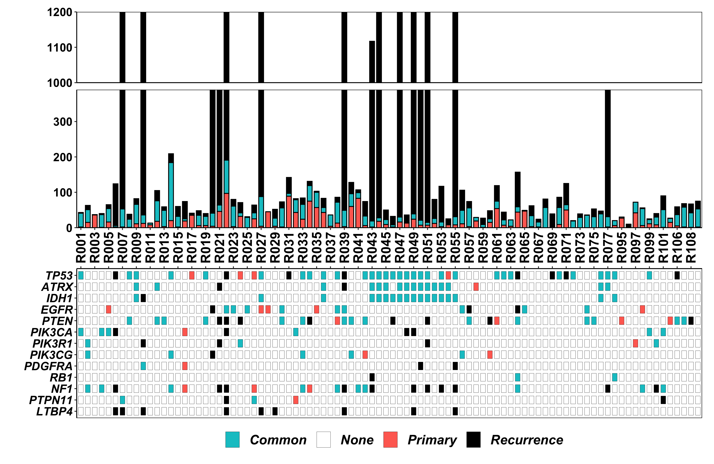
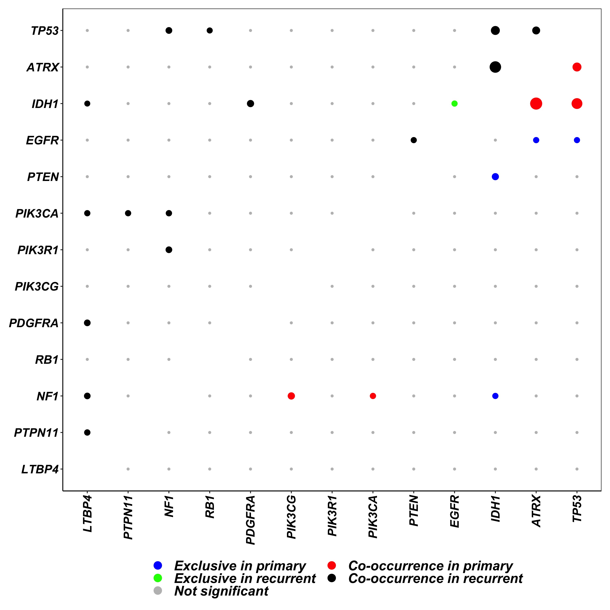
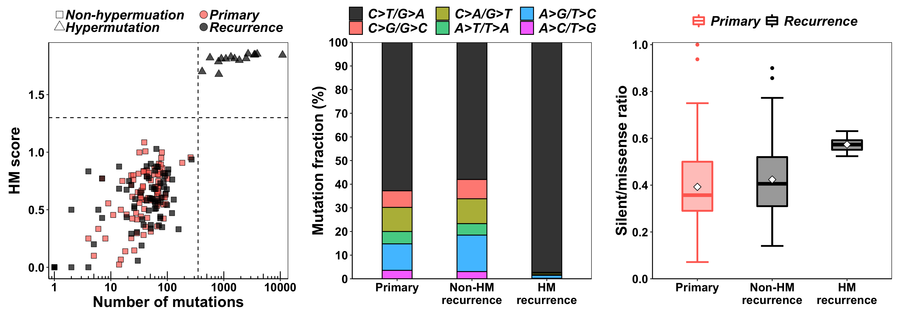
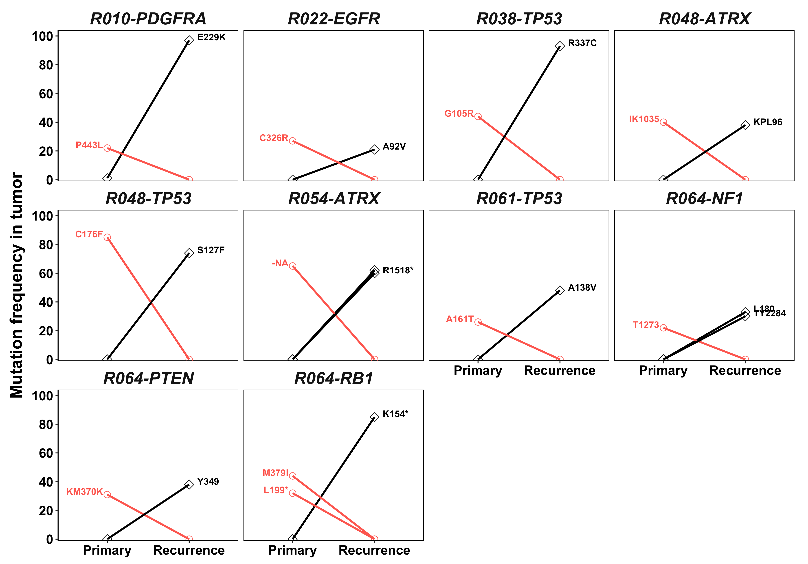
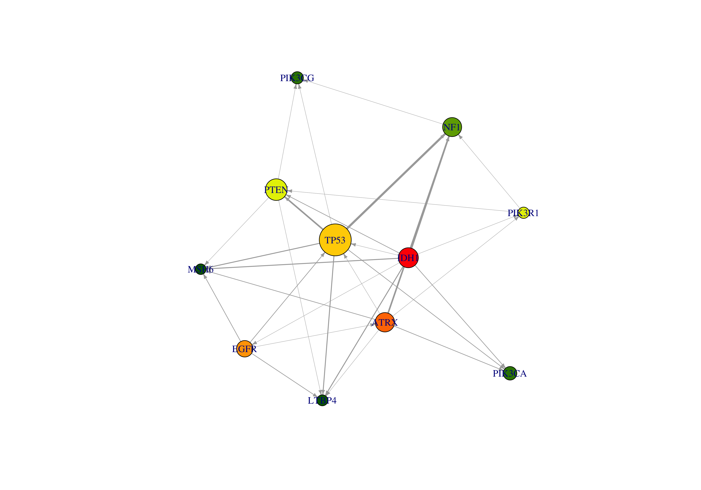

CELLO: Cancer EvoLutionary analysis using LOngitudinal genomic data
================
SONG, Dong
5/26/2020

## Ownership

Wang Lab at HKUST (<http://wang-lab.ust.hk/>)

## Introduction

Cancer EvoLutionary analysis using LOngitudinal genomic data (CELLO) is
a protocal for comprehensive analysis of longitudinal genomic sequencing
data in cancer. It was originally developed by Jiguang Wang \[1,2\], and
was then packed up by Biaobin Jiang and Dong Song in MATLAB and R
seperately. This code was written in R.

## Datasets

The input SAVI report (input.savi.txt) consists of a list of genetic
variants from 90 glioblastoma
    patients.

## Loading CELLO package

``` r
source('CELLO.R')
```

## CELLO Pipeline

``` r
savi.table <- mutRead("../../input.savi.txt",20,1,5)
```

``` r
head(savi.table[,1:10])
```

    ##     chr       pos ref alt                              Effect Effect_Impact
    ## 1 chr10   5248362   T   C splice_donor_variant+intron_variant          HIGH
    ## 2 chr10  27703023   A   T                    missense_variant      MODERATE
    ## 3 chr10 122263428   G   A                    missense_variant      MODERATE
    ## 4 chr11    209598   C   T                  synonymous_variant           LOW
    ## 5 chr11  20676292  TG   T                  frameshift_variant          HIGH
    ## 6 chr12  21422680   C   T                  synonymous_variant           LOW
    ##   Functional_Class Codon_Change Amino_Acid_Change Amino_Acid_length
    ## 1                -            -                 -               323
    ## 2         MISSENSE      Tcc/Acc              S53T               767
    ## 3         MISSENSE      cGc/cAc              R52H               271
    ## 4           SILENT      tcC/tcT              S108               537
    ## 5                -         tgg/              W758               797
    ## 6           SILENT      ccG/ccA              P605               670

``` r
knownDriverGene <- c('LTBP4','PTPN11','NF1','RB1','PDGFRA','PIK3CG','PIK3R1','PIK3CA','PTEN','EGFR','IDH1','ATRX','TP53')
stats <- mutStats(savi.table, knownDriverGene,5,remove_LOW = TRUE)
```

``` r
head(stats$mutNum.table)
```

    ##   Patients Primary Common Recurrent
    ## 1     R001       2     39         2
    ## 2     R002      15     36        12
    ## 3     R003      36      0         1
    ## 4     R004       1     36         3
    ## 5     R005      16     38        11
    ## 6     R006       2      4       118

``` r
head(stats$mutGenes.table)
```

    ##      LTBP4 PTPN11 NF1 RB1 PDGFRA PIK3CG PIK3R1 PIK3CA PTEN EGFR IDH1 ATRX TP53
    ## R001 "N"   "N"    "N" "N" "N"    "N"    "N"    "C"    "N"  "N"  "N"  "N"  "C" 
    ## R002 "N"   "N"    "C" "N" "N"    "C"    "C"    "N"    "N"  "N"  "N"  "N"  "N" 
    ## R003 "N"   "N"    "N" "N" "N"    "N"    "N"    "N"    "N"  "N"  "N"  "N"  "N" 
    ## R004 "N"   "N"    "C" "N" "N"    "N"    "N"    "C"    "N"  "N"  "N"  "N"  "N" 
    ## R005 "N"   "N"    "N" "N" "N"    "N"    "N"    "C"    "N"  "P"  "N"  "N"  "N" 
    ## R006 "R"   "N"    "R" "N" "N"    "N"    "N"    "R"    "N"  "N"  "N"  "N"  "R"

``` r
mutLandscape(stats$mutNum.table,stats$mutGenes.table)
```



``` r
mutCorrelation(stats$mutGenes.table)
```



``` r
freq.table <- mutFrequency(savi.table, knownDriverGene,stats$mutGenes.table,5)
```


``` r
head(freq.table)
```

    ##        Primary Recurent Common
    ## LTBP4        0        9      0
    ## PTPN11       1        2      2
    ## NF1          4       12     10
    ## RB1          1        2      2
    ## PDGFRA       2        3      1
    ## PIK3CG       2        1      5

``` r
hm.table <- mutSignature(savi.table,15,350,1.2)
```



    ## P-value between Primary and NonHM Recurrence: 0.229260285986123
    ## P-value between Primary and HM Recurrence: 2.59649100398582e-06
    ## P-value between NonHM Recurrence and HM Recurrence: 4.38254782225301e-05

``` r
cluster.table <- mutTreeClustering(stats$mutNum.table)
```


``` r
switch.table <- mutSwitch(savi.table,knownDriverGene,5,20)
```



``` r
selGene <-c('LTBP4','IDH1','ATRX','TP53','NF1','MSH6','PIK3CG','PIK3R1','PIK3CA','PTEN','EGFR')
selStats <- mutStats(savi.table, selGene,5,remove_LOW = TRUE)
TEDG <- mutDirectedGraph(selStats$mutGenes.table)
```



``` r
TEDG$node.table
```

    ##      Gene     P_CDF         FC Occurrence
    ## 1   LTBP4 0.0625000 -2.5849625          9
    ## 2    IDH1 0.0078125  3.1699250         37
    ## 3    ATRX 0.1250000  1.8073549         35
    ## 4    TP53 0.5078125  0.8073549         74
    ## 5     NF1 0.3750000 -1.3219281         34
    ## 6    MSH6 0.0625000 -2.5849625          8
    ## 7  PIK3CG 0.2500000 -2.0000000         13
    ## 8  PIK3R1 1.0000000  0.0000000         10
    ## 9  PIK3CA 0.2500000 -2.0000000         17
    ## 10   PTEN 1.0000000  0.0000000         42
    ## 11   EGFR 0.3750000  1.3219281         26

``` r
TEDG$edge.table
```

    ##    geneA    geneB    weight label                               
    ## 1  "IDH1"   "LTBP4"  "3"    "R027;R049;R055"                    
    ## 2  "ATRX"   "LTBP4"  "1"    "R049"                              
    ## 3  "TP53"   "LTBP4"  "3"    "R027;R049;R055"                    
    ## 4  "PTEN"   "LTBP4"  "1"    "R039"                              
    ## 5  "EGFR"   "LTBP4"  "2"    "R022;R039"                         
    ## 6  "IDH1"   "TP53"   "1"    "R054"                              
    ## 7  "IDH1"   "NF1"    "5"    "R043;R049;R051;R053;R055"          
    ## 8  "IDH1"   "MSH6"   "3"    "R027;R044;R051"                    
    ## 9  "IDH1"   "PIK3R1" "1"    "R051"                              
    ## 10 "IDH1"   "PIK3CA" "2"    "R048;R049"                         
    ## 11 "IDH1"   "PTEN"   "2"    "R046;R051"                         
    ## 12 "IDH1"   "EGFR"   "1"    "R027"                              
    ## 13 "ATRX"   "TP53"   "1"    "R054"                              
    ## 14 "ATRX"   "NF1"    "5"    "R043;R049;R051;R053;R077"          
    ## 15 "ATRX"   "MSH6"   "2"    "R044;R051"                         
    ## 16 "ATRX"   "PIK3R1" "1"    "R051"                              
    ## 17 "ATRX"   "PIK3CA" "2"    "R048;R049"                         
    ## 18 "EGFR"   "ATRX"   "1"    "R039"                              
    ## 19 "TP53"   "NF1"    "7"    "R034;R043;R049;R051;R053;R055;R077"
    ## 20 "TP53"   "MSH6"   "3"    "R027;R044;R051"                    
    ## 21 "TP53"   "PIK3CG" "1"    "R042"                              
    ## 22 "TP53"   "PIK3CA" "2"    "R048;R049"                         
    ## 23 "TP53"   "PTEN"   "5"    "R034;R038;R046;R051;R061"          
    ## 24 "EGFR"   "TP53"   "2"    "R022;R039"                         
    ## 25 "NF1"    "PIK3CG" "1"    "R042"                              
    ## 26 "PIK3R1" "NF1"    "1"    "R100"                              
    ## 27 "PTEN"   "MSH6"   "1"    "R039"                              
    ## 28 "EGFR"   "MSH6"   "2"    "R022;R039"                         
    ## 29 "PTEN"   "PIK3CG" "1"    "R042"                              
    ## 30 "PIK3R1" "PTEN"   "1"    "R024"

## Reference

\[1\] Wang, J., Cazzato, E., Ladewig, E., Frattini, V., Rosenbloom, D.
I., Zairis, S., … & Lee, J. K. (2016). Clonal evolution of glioblastoma
under therapy. Nature Genetics, 48(7), 768-776.

\[2\] Wang, J., Khiabanian, H., Rossi, D., Fabbri, G., Gattei, V.,
Forconi, F., … & Pasqualucci, L. (2014). Tumor evolutionary directed
graphs and the history of chronic lymphocytic leukemia. Elife, 3,
e02869.
