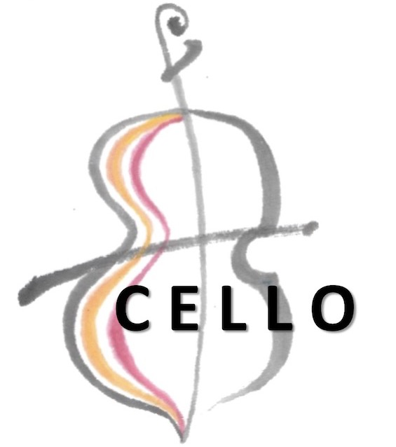

# CELLO - Cancer EvoLution for LOngitudinal data

## Ownership
[Wang Lab at HKUST](http://wang-lab.ust.hk/)

## Status
Active Development

## Introduction
Cancer EvoLution for LOngitudinal data (CELLO) is a MATLAB toolbox for comprehensive analysis of longitudinal genomic sequencing data in cancer. It was originally developed by Jiguang Wang [1,2], and the implementation has both MATLAB and R version:
* [MATLAB](./CELLOM/CELLOM.md)
* [R](./CELLOR/CELLOR.md)

## Datasets

The input [SAVI report](./input.savi.txt) consists of a list of genetic variants from 90 glioblastoma patients.

## Reference

[1] Jiguang Wang, Emanuela Cazzato, Erik Ladewig, Veronique Frattini, Daniel I S Rosenbloom, Sakellarios Zairis, Francesco Abate, Zhaoqi Liu, Oliver Elliott, Yong-Jae Shin, Jin-Ku Lee, In-Hee Lee, Woong-Yang Park, Marica Eoli, Andrew J Blumberg, Anna Lasorella, Do-Hyun Nam, Gaetano Finocchiaro, Antonio Iavarone, Raul Rabadan. (2016). [Clonal evolution of glioblastoma under therapy.](https://www.nature.com/articles/ng.3590) **Nature Genetics**, 48(7), 768-776.

[2] Jiguang Wang, Hossein Khiabanian, Davide Rossi, Giulia Fabbri, Valter Gattei, Francesco Forconi, Luca Laurenti, Roberto Marasca, Giovanni Del Poeta, Robin Foà, Laura Pasqualucci, Gianluca Gaidano, Raul Rabadan. (2014). [Tumor evolutionary directed graphs and the history of chronic lymphocytic leukemia.](https://elifesciences.org/articles/02869) **Elife**, 3, e02869.

## Citation

The abstract of this project has been accepted by [AsiaEvo 2018](http://www.asianevo.org/) for oral presentation.

## Contact

For technical questions, please contact Professor Jiguang Wang via email: jgwang AT ust.hk
